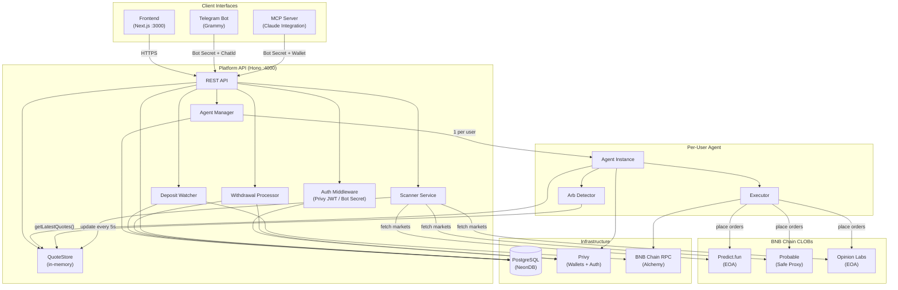
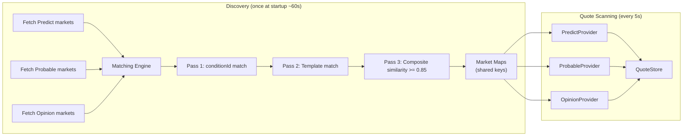
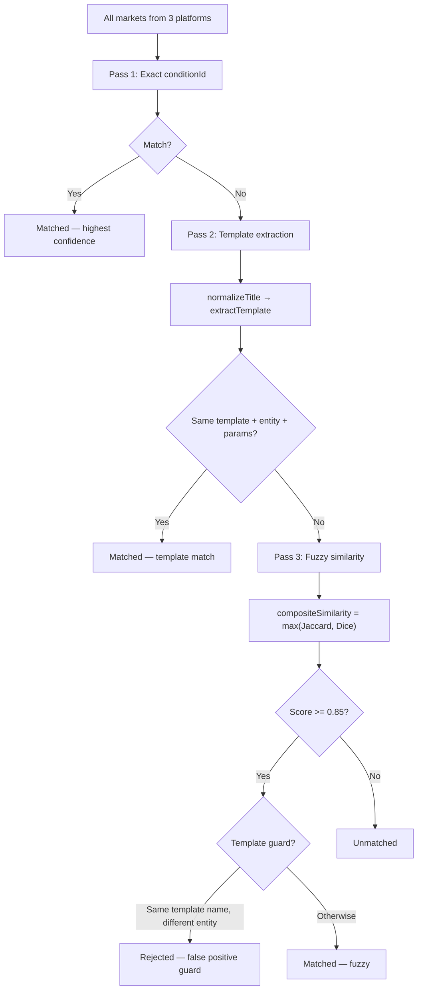
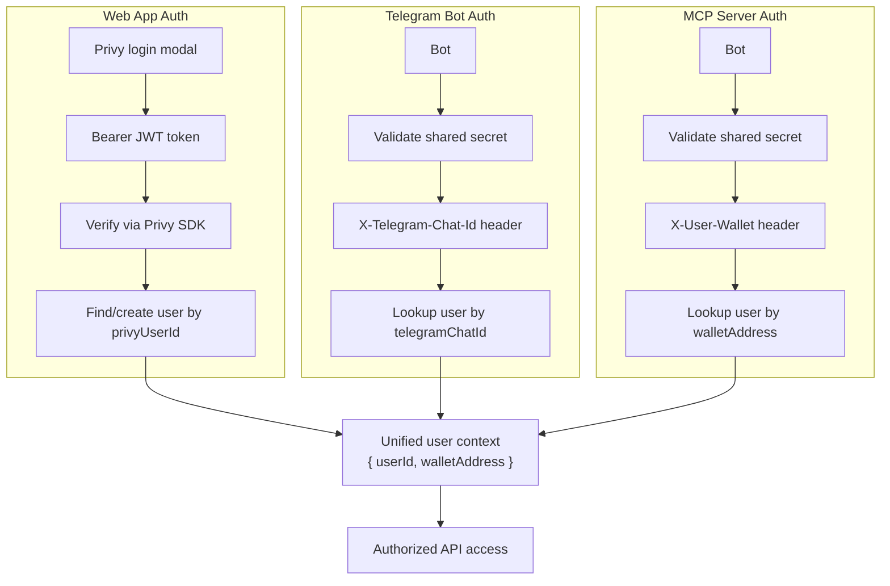
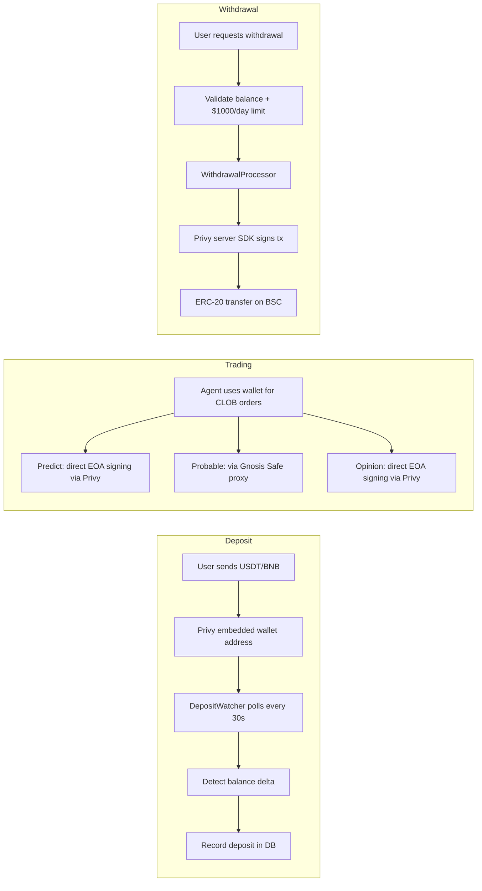
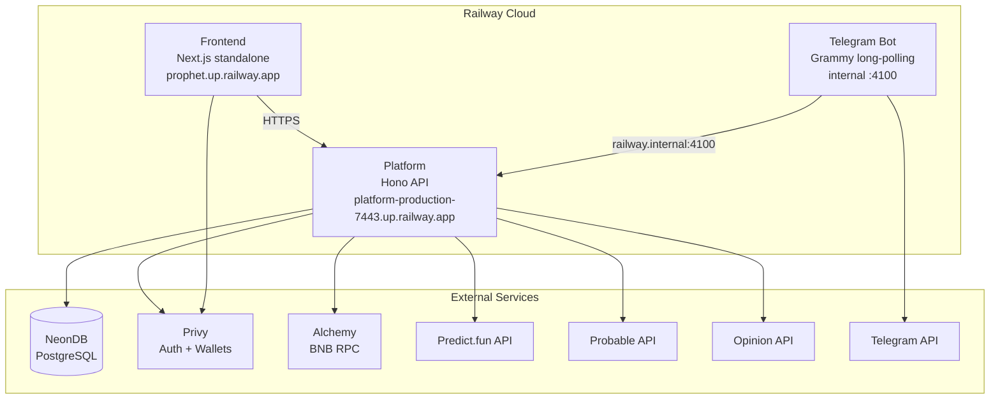

# System Architecture

## High-Level Overview

Prophet is a prediction market arbitrage platform that detects and executes cross-platform spread opportunities across three BNB Chain CLOBs: **Predict.fun**, **Probable**, and **Opinion Labs**.



## Component Details

### Scanner Service

Runs on platform startup. Responsible for market discovery and continuous quote fetching.



### Matching Engine (3-Pass)

Cross-platform market matching with increasing fuzziness per pass.



### Auth Flow

Three authentication paths converge into a unified user context.



### Wallet & Fund Flow

Privy-custodied embedded wallets with on-chain deposits and withdrawals on BNB Chain.



### Database Schema

```mermaid
erDiagram
    users {
        text id PK "Privy userId"
        text walletAddress UK
        text telegramChatId UK
        timestamp createdAt
        timestamp lastLoginAt
    }

    tradingWallets {
        serial id PK
        text userId FK
        text address UK "Privy embedded EOA"
        text privyWalletId
        text safeProxyAddress "Gnosis Safe for Probable"
    }

    userConfigs {
        serial id PK
        text userId FK UK
        numeric minTradeSize "default $5"
        numeric maxTradeSize "default $100"
        integer minSpreadBps "default 100"
        integer maxSpreadBps "default 400"
        integer maxTotalTrades
        integer tradingDurationMs
        numeric dailyLossLimit "default $50"
        integer maxResolutionDays
        text agentStatus "stopped|running|error"
        timestamp tradingStartedAt
    }

    deposits {
        serial id PK
        text userId FK
        text txHash UK
        text token
        numeric amount
        timestamp confirmedAt
    }

    withdrawals {
        serial id PK
        text userId FK
        text toAddress
        text token
        numeric amount
        text status "pending|processing|confirmed|failed"
        text txHash
        timestamp createdAt
    }

    trades {
        serial id PK
        text userId FK
        text marketId
        text status "OPEN|PARTIAL|FILLED|CLOSED"
        jsonb legA
        jsonb legB
        integer totalCost "cents"
        integer expectedPayout "cents"
        integer spreadBps
        integer pnl "cents"
        timestamp openedAt
        timestamp closedAt
    }

    users ||--o| tradingWallets : has
    users ||--o| userConfigs : has
    users ||--o{ deposits : receives
    users ||--o{ withdrawals : requests
    users ||--o{ trades : executes
```

## Deployment Architecture



## Tech Stack Summary

| Component | Technology | Port |
|---|---|---|
| Frontend | Next.js 14, React, TailwindCSS, Privy SDK | 3000 |
| Platform API | Hono, Node.js | 4000 |
| Telegram Bot | Grammy, Node.js | 4100 (notifications) |
| MCP Server | @modelcontextprotocol/sdk, stdio | local |
| Database | PostgreSQL (NeonDB) + Drizzle ORM | — |
| Auth | Privy (JWT + embedded wallets) | — |
| Chain | BNB Chain (chainId 56) | — |
| RPC | Alchemy | — |
| Deployment | Railway (Docker) | — |
