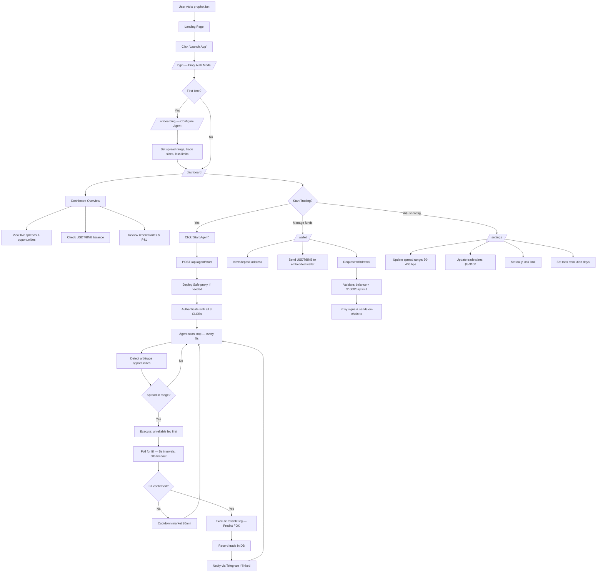
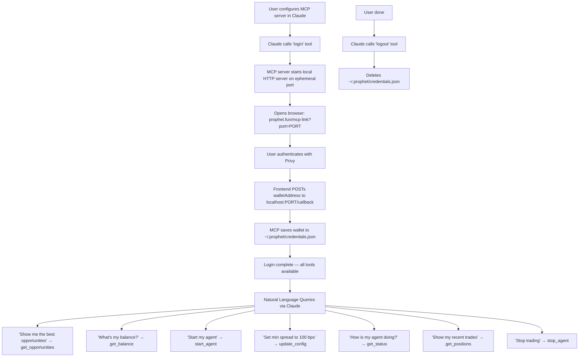

# User Journey

## Web Application Flow

The primary user journey through the Prophet web application — from first visit to automated arbitrage trading.

### UX Improvements vs Existing Tools

| Existing Tools | Prophet |
|---|---|
| Manual monitoring of multiple CLOB orderbooks | Automated cross-platform spread detection |
| Manual trade execution on each platform separately | One-click agent start, sequential execution handled automatically |
| No unified view of positions across platforms | Unified dashboard with cross-platform P&L |
| Requires managing multiple wallets & approvals | Privy embedded wallet — single custodied wallet, delegated signing |
| Desktop-only CLOB interfaces | Telegram bot for monitoring & control on mobile |
| No AI-native interface | MCP server for natural language market queries via Claude |

### Full User Flow



## Telegram Bot Flow

Mobile-first monitoring and control via Telegram.

```mermaid
flowchart TD
    A[User opens @ProphetArbBot] --> B[Send /start]
    B --> C{Account linked?}

    C -->|No| D[Bot sends link URL]
    D --> E[User opens prophet.fun/link-telegram?chatId=xxx]
    E --> F[Privy auth in browser]
    F --> G[Frontend POSTs chatId to /api/me/telegram/link]
    G --> H[Platform stores telegramChatId on user]
    H --> I[Platform webhooks bot notification server]
    I --> J[Bot sends welcome message with balance & status]

    C -->|Yes| K[Welcome back message]

    J --> L[Telegram Commands Available]
    K --> L

    L --> M[/status — Agent running? Trades? Uptime?]
    L --> N[/run — Start agent remotely]
    L --> O[/stop — Stop agent remotely]
    L --> P[/opportunities — Top live spreads]
    L --> Q[/balance — USDT/BNB balances]
    L --> R[/positions — Open positions]
    L --> S[/config — Current settings]
    L --> T["/set key value — Update config"]
    L --> U[/logout — Unlink Telegram]

    V[Agent executes trade] --> W[Platform POSTs to bot /notify]
    W --> X[Bot formats & sends trade notification]
    X --> Y["Trade alert with market, side, cost, spread"]
```

## MCP Server Flow (Claude Integration)

AI-native interface for querying and controlling Prophet via Claude desktop or CLI.



## Trade Execution Detail

The core arbitrage execution flow showing the sequential strategy.

```mermaid
flowchart TD
    A[Agent detects spread opportunity] --> B{Spread >= minSpreadBps?}
    B -->|No| Z[Skip]
    B -->|Yes| C{Spread <= maxSpreadBps?}
    C -->|No| Z
    C -->|Yes| D{Recently traded? — 5min dedup}
    D -->|Yes| Z
    D -->|No| E{Daily loss limit OK?}
    E -->|No| Z
    E -->|Yes| F[Select best opportunity]

    F --> G{Which platforms?}
    G -->|Probable + Predict| H[Probable = unreliable leg]
    G -->|Opinion + Predict| I[Opinion = unreliable leg]
    G -->|Opinion + Probable| J[Lower liquidity = unreliable leg]

    H --> K[Place order on unreliable leg first]
    I --> K
    J --> K

    K --> L[Poll for fill: 5s interval, 60s timeout]
    L --> M{Leg A filled?}
    M -->|Timeout| N[Record PARTIAL trade]
    N --> O[30-min cooldown on market]
    M -->|Filled| P[Place FOK order on reliable leg]
    P --> Q{Leg B filled?}
    Q -->|No| R[Record PARTIAL trade — hedging risk]
    Q -->|Yes| S[Record FILLED trade]
    S --> T[Calculate P&L]
    T --> U[Notify user via Telegram]
